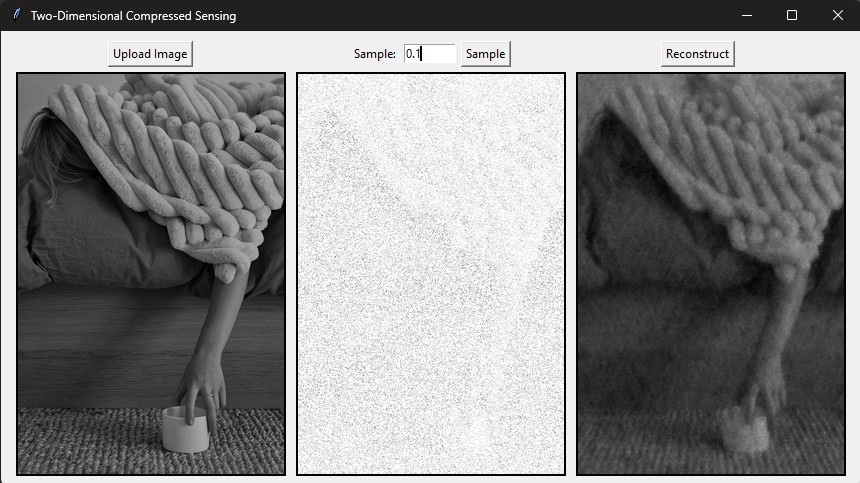
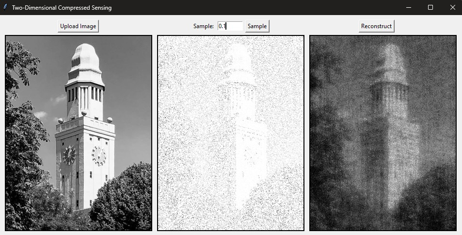

**Two-Dimensional Compressed Sensing**

This application recovers full images from a small percentage of randomly sampled pixels using L1-regularized optimization in the 2D Discrete Cosine Transform (DCT) domain.

Examples

How It Works

1. Sparse Sampling: Randomly selects a fraction of pixels from the original image
2. L1-Minimization: Uses L-BFGS-B optimization to find the sparsest representation in the DCT domain that matches the sampled pixels
3. Reconstruction: Transforms the solution back to the spatial domain to reconstruct the full image

Technical Details

- Transform Domain: 2D Discrete Cosine Transform (DCT)
- Optimization Method: L-BFGS-B with L1 regularization
- Processing: Each color channel is reconstructed independently

 Requirements

- Python 3.x
- tkinter
- PIL (Pillow)
- NumPy
- SciPy
